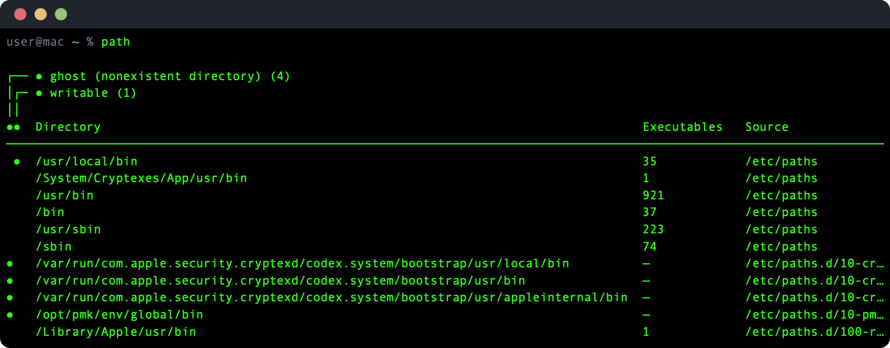

# pathfinder

Display PATH entries with their source files, executable counts, and ownership analysis.



## Install

```sh
make build && make install
```

## Usage

```
USAGE: path [--dupes]

OPTIONS:
  -d, --dupes   Show only duplicate entries
  --version     Show the version.
  -h, --help    Show help information.
```

### Examples

```sh
path            # Show all PATH entries with sources
path --dupes    # Show only duplicate PATH entries
```

## License

MIT
